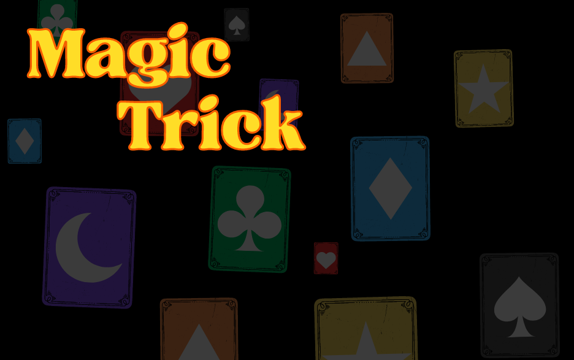

---

# MagicTrick_Tirana

MagicTrick_Tirana é um jogo de cartas desenvolvido em C#. O objetivo do jogo é implementar a lógica de um bot que toma decisões estratégicas durante o jogo.

## Funcionalidades

- **Gerenciamento de Jogadores**: Controle e atualização das informações dos jogadores.
- **Decisões do Bot**: O bot "BotZob" toma decisões estratégicas com base nas cartas e jogadas anteriores.
- **Lógica de Jogo**: Implementação de regras e lógicas para diferentes situações no jogo.
- **Apostas**: O bot faz apostas e joga cartas grandes para garantir a pontuação necessária.

## Estrutura do Projeto

O projeto é organizado da seguinte maneira:

```
MagicTrick_Tirana/
├── Bot
  ├── BotZob.cs
  ├── JogadorInfo.cs
├── ImagensCartas
├── Menu
  ├── Form1.cs
  ├── Lobby.cs
├── PacoteCartes
  ├── Cartas.cs
├──Partida
  ├── Partida.cs
  ├── Mesa.cs
  ├── Verificacao.cs
  ├── AtributosPartida.cs
├── Tratamento.cs
├── Program.cs
├── README.md
└── ...
```

### BotZob.cs

A classe `BotZob` é responsável pela lógica do bot. Ela contém métodos para:

- **Atualizar Informações dos Jogadores**: Atualiza as cartas e informações dos jogadores a cada rodada.
- **Tomar Decisões de Jogada**: Seleciona a melhor carta para iniciar ou seguir jogadas.
- **Apostas**: Implementa a lógica de apostas do bot, jogando cartas grandes para garantir pontos.

### Partida.cs

A classe `Partida` gerencia o andamento do jogo, mantendo um histórico das jogadas.

### JogadorInfo.cs

A classe `JogadorInfo` armazena as informações de cada jogador, como as cartas na mão e a pontuação.

### Program.cs

O ponto de entrada do programa, onde o jogo é inicializado e as partidas são gerenciadas.

### Banco de Dados

O banco de dados utilizado foi disponibilizado pelo orientador responsavel pela materia de projetos da universidade SENAC do Bacharelado Ciencia da Computação, o coordenador Thiago Claro.

## Como Jogar

1. **Clone o repositório:**
   ```bash
   git clone https://github.com/GiPaiva/MagicTrick_Tirana.git
   cd MagicTrick_Tirana
   ```

2. **Abra o projeto em uma IDE compatível com C#** (como Visual Studio).

3. **Execute o projeto**. O programa inicializa uma nova partida e o bot começa a tomar decisões com base nas regras implementadas.

## Contribuição

Contribuições são bem-vindas! Se você tiver sugestões de melhorias ou novos recursos, sinta-se à vontade para abrir uma issue ou um pull request.

1. **Fork o repositório**
2. **Crie uma nova branch** (`git checkout -b feature/nova-funcionalidade`)
3. **Commit suas alterações** (`git commit -m 'Adiciona nova funcionalidade'`)
4. **Push para a branch** (`git push origin feature/nova-funcionalidade`)
5. **Abra um Pull Request**

## Licença

Este projeto está licenciado sob a licença MIT. Veja o arquivo [LICENSE](LICENSE) para mais detalhes.

## Contato

Para mais informações ou dúvidas, entre em contato com um dos participantes iniciais do projeto.

## Participantes

- **Gabriel Lopes** - [GitHub](https://github.com/gabribaruelcl)
- **Giovanna Paiva** - [GitHub](https://github.com/GiPaiva)
- **Larissa Caetano** - [GitHub](https://github.com/lauris14)
- **Pedro Henrique Nascimento** - [GitHub](https://github.com/pedrohn3)

---
